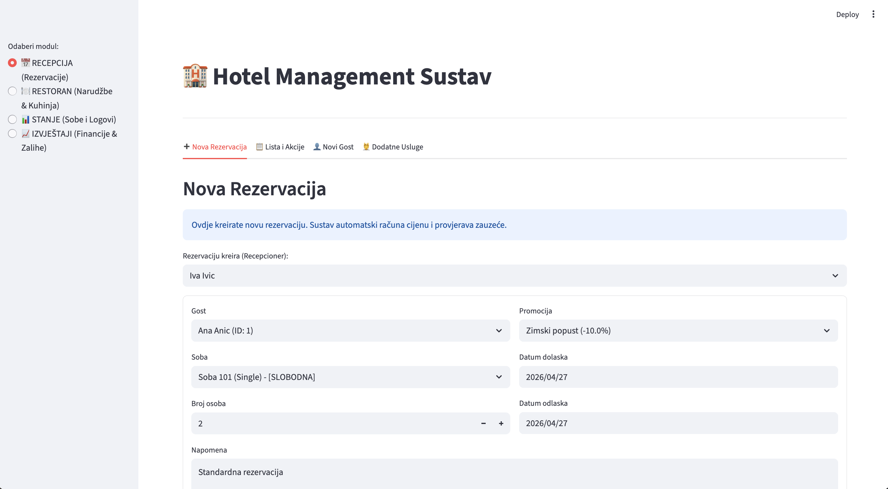
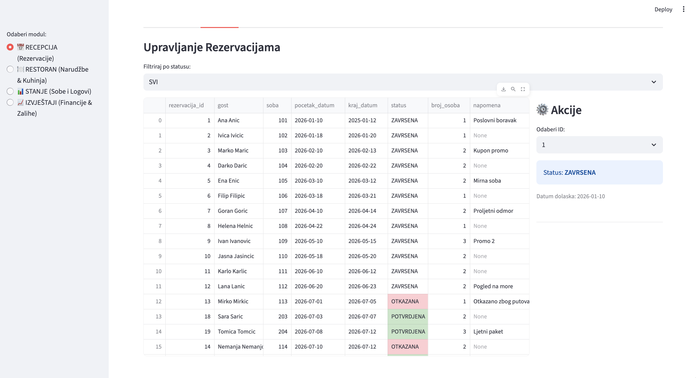
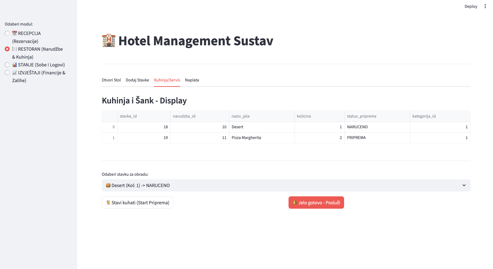
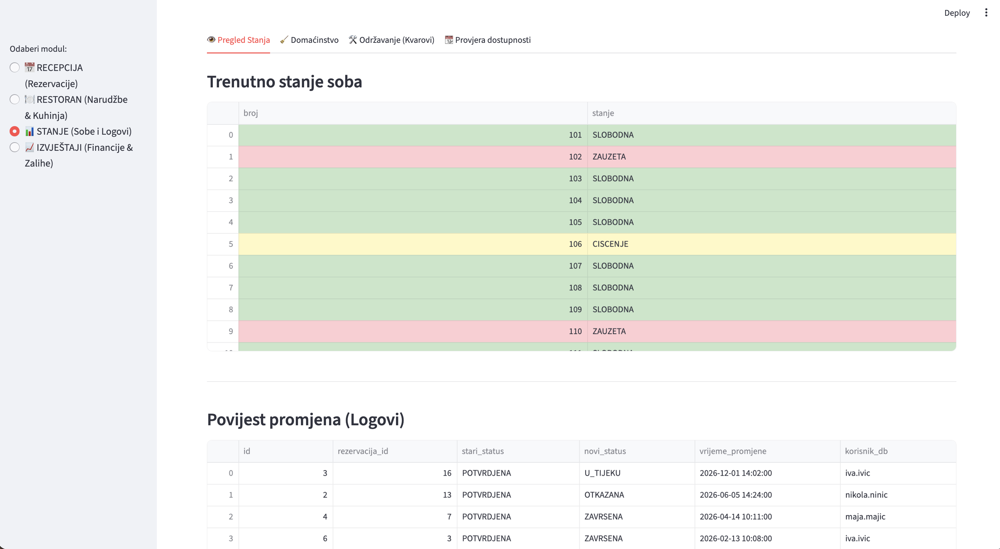
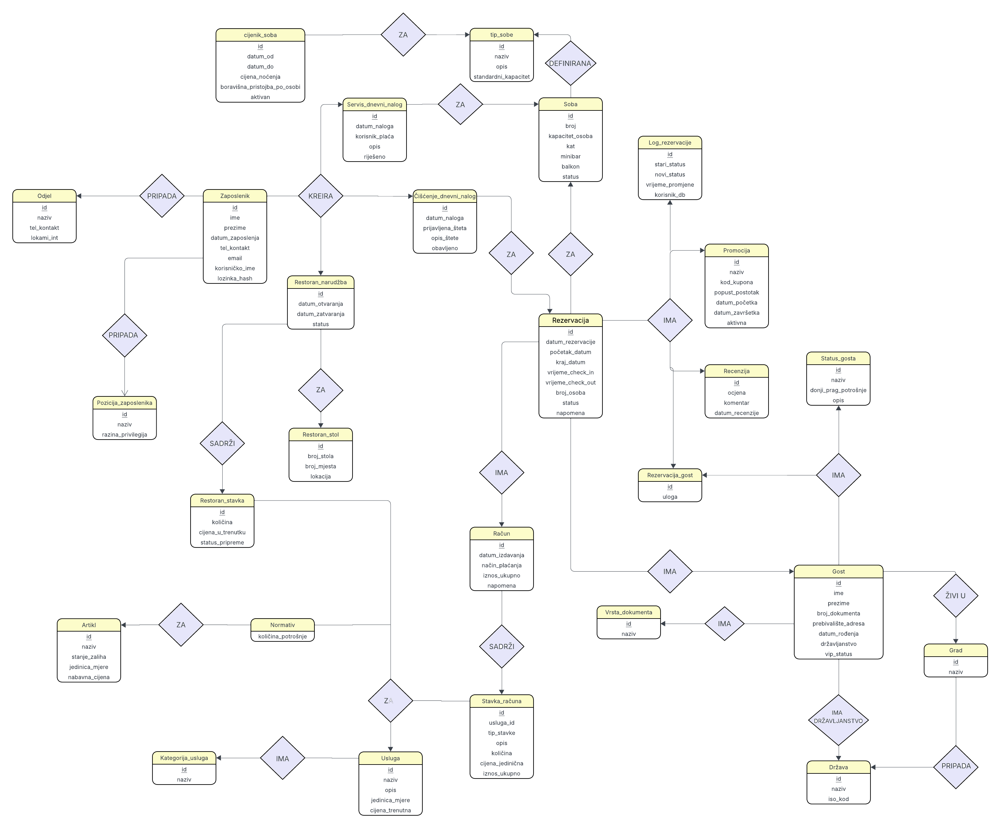
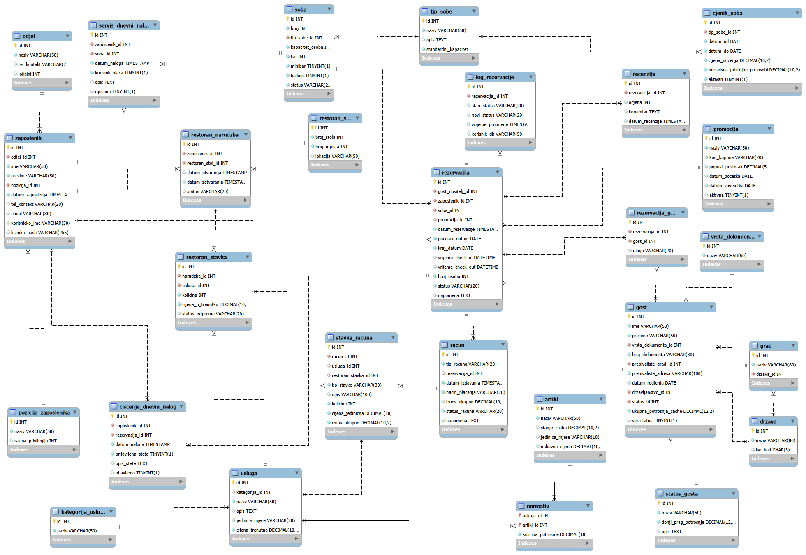

# Hotel Management System

A hotel management system built with Python (Streamlit) and MySQL.

## Features

- **Reservation Management** - Create, confirm, check-in, check-out, and cancel reservations with automatic price calculation and room availability checks
- **Guest Registry** - Register new guests with document and address information; add companions to existing reservations
- **Restaurant & Kitchen** - Open table orders, add menu items, track food preparation status (ordered/preparing/served), and process payments (cash, card, or charged to room)
- **Room Status Dashboard** - Real-time color-coded overview of all rooms (free, occupied, cleaning, out of service)
- **Housekeeping Module** - Track rooms that need cleaning after checkout, log damage reports, and mark rooms as cleaned
- **Maintenance & Repairs** - Report faults/breakdowns, automatically set rooms out of service, and close repair orders when resolved
- **Room Availability Check** - Search for available rooms by date range and guest count, with pricing from the seasonal price list
- **Billing & Invoices** - Generate and review invoices per reservation, including accommodation, tourist tax, services, and restaurant charges
- **Inventory & Stock** - Monitor warehouse stock levels with low-stock alerts, view recipes/norms with ingredient cost breakdown and profit margin calculation
- **Promotions & Discounts** - Apply coupon-based promotions to reservations with automatic validation (active status, date range)
- **VAT Reporting** - Calculate annual VAT obligations across accommodation, services, and restaurant revenue
- **Guest Reviews** - View and respond to guest reviews with status tracking (needs action / resolved)

## Screenshots









## Installation and Setup

First, install the required libraries via terminal:

```bash
pip install streamlit mysql-connector-python pandas
```

### Database Configuration

At the top of the code there is a function for connecting to the database.

**Note:** Enter the user and password that you use to connect to MySQL Workbench.

```python
def get_connection():
    return mysql.connector.connect(
        host="localhost",
        user="root",           # <-- YOUR MYSQL USER (often root)
        password="password",   # <-- YOUR PASSWORD
        database="novi_projekt"
    )
```

## Usage

Run the application with the command:

```bash
streamlit run app/main.py
```

## Database Diagrams




